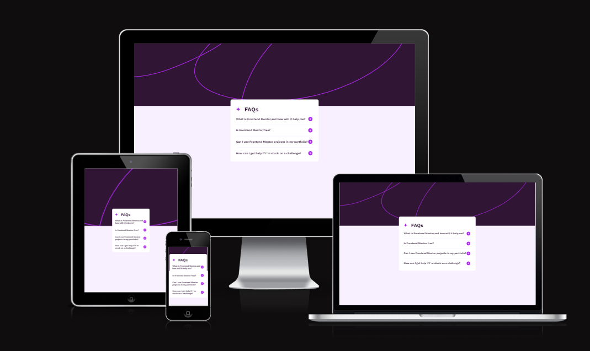

# Frontend Mentor - Product FAQ accordion
This is a solution to the [Product FAQ Accordion Challenge on Frontend Mentor](https://www.frontendmentor.io/challenges/faq-accordion-wyfFdeBwBz/hub). Frontend Mentor Challenges help you improve your programming skills by creating realistic projects. The goal of this challenge was to hide a paragraph on click and show it again on click using JavaScript.

## Table of contents

- [Overview](#overview)
  - [Screenshot](#screenshot)
  - [Links](#links)
- [My process](#my-process)
  - [Built with](#built-with)
  - [Frameworks](#frameworks)
  - [Tools](#tools)
  - [What I learned](#what-i-learned)
  - [Continued development](#continued-development)
- [Author](#author)

## Overview

### Screenshot

### Links

- Solution URL: [Github-Solution](https://github.com/Adem-Tozlu/Frontend-Mentor-FAQ)
- Live Site URL: [Website-QR.Code](https://frontend-mentor-faq-alpha.vercel.app/)

## My process

### Built with

- Semantic HTML5 markup
- CSS custom properties
- Flexbox
- Mobile-design
- Grid
- Javascript

## Frameworks
 - React

## Tools
 - Vite

## What I learned 
I learned how to use JavaScript in React. Since I was new to React, this was a big step forward for me.

## Continued development
I will create more projects in Frontend Mentor in the future to further develop my React skills.

## Author

- Website - [Github](https://github.com/Adem-Tozlu)
- Frontend Mentor - [@AdemTozlu](https://www.frontendmentor.io/profile/Adem-Tozlu)
- Linkedin - [@Adem-Tozlu](https://www.linkedin.com/in/adem-tozlu-8906b52a5)